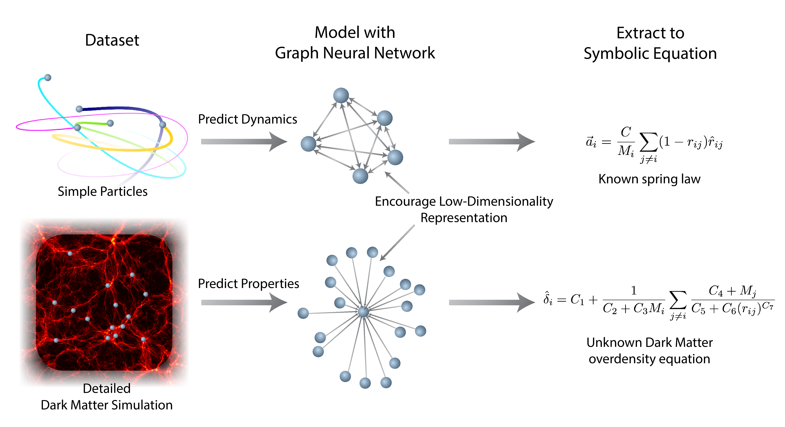
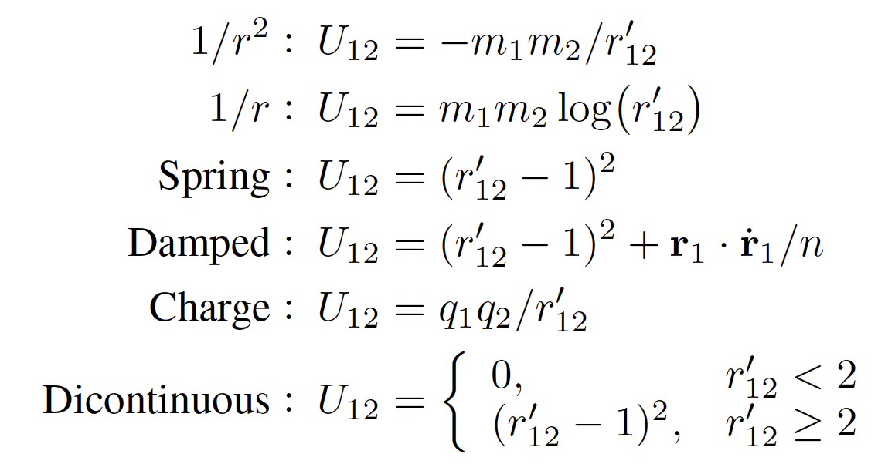
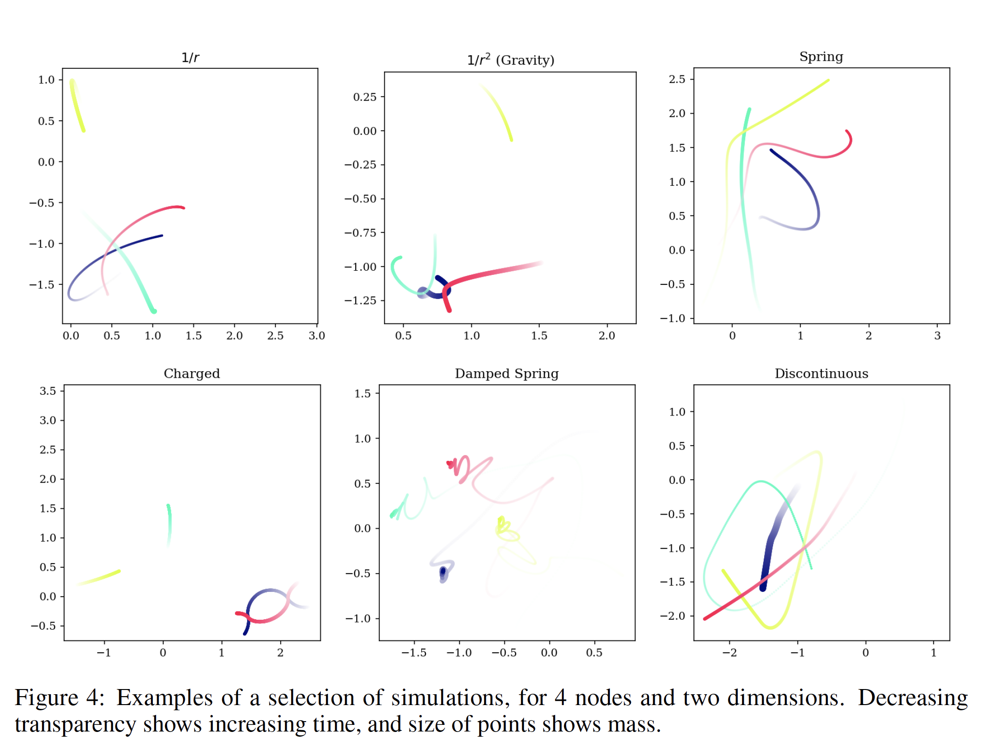
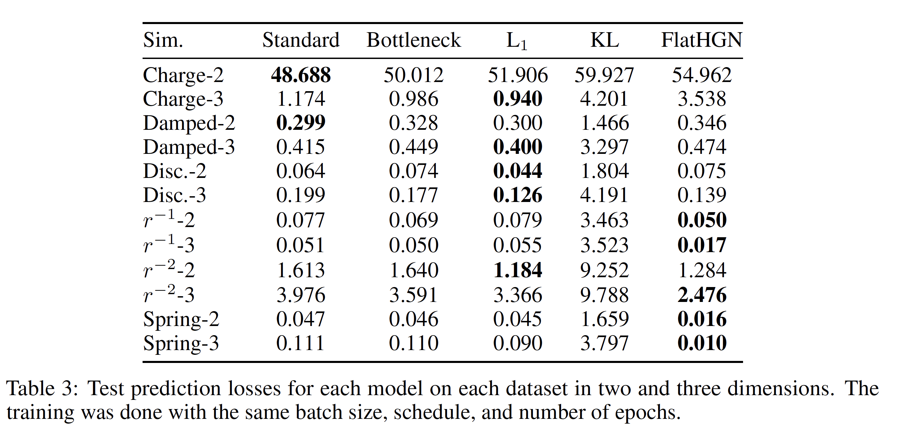
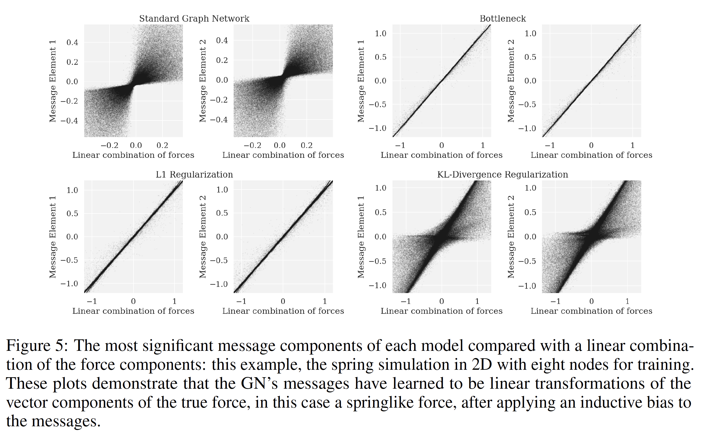
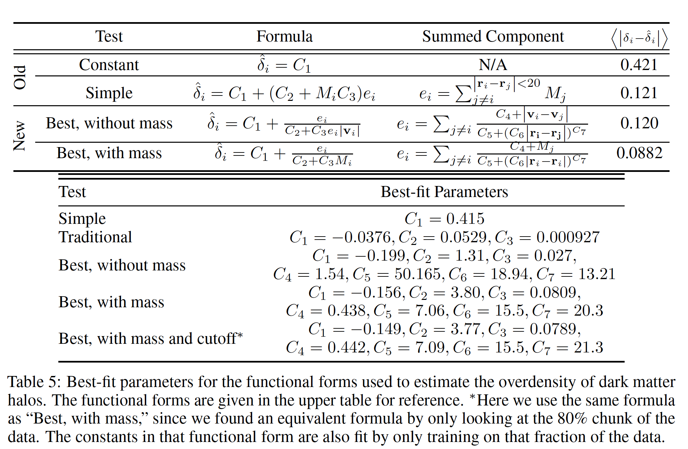

# [Discovering Symbolic Models from Deep Learning with Inductive Biases](https://arxiv.org/abs/2006.11287)

This [repository](https://github.com/MilesCranmer/symbolic_deep_learning) is the official implementation of [Discovering Symbolic Models from Deep Learning with Inductive Biases](https://arxiv.org/abs/2006.11287). 

Miles Cranmer, Alvaro Sanchez-Gonzalez, Peter Battaglia, Rui Xu, Kyle Cranmer, David Spergel, Shirley Ho

Check out our [Blog](https://astroautomata.com/paper/symbolic-neural-nets/), [Paper](https://arxiv.org/abs/2006.11287), [Video](https://youtu.be/2vwwu59RPL8), and [Interactive Demo](https://colab.research.google.com/github/MilesCranmer/symbolic_deep_learning/blob/master/GN_Demo_Colab.ipynb).

## Requirements

For model:

- pytorch
- [pytorch-geometric](https://github.com/rusty1s/pytorch_geometric)
- numpy

Symbolic regression:
- [PySR](https://github.com/MilesCranmer/PySR), our new open-source Eureqa alternative

For simulations:

- [jax](https://github.com/google/jax) (simple N-body simulations)
- [quijote](https://github.com/franciscovillaescusa/Quijote-simulations) (Dark matter data; optional)
- tqdm
- matplotlib

## Training

To train an example model from the paper, try out the [demo](https://colab.research.google.com/github/MilesCranmer/symbolic_deep_learning/blob/master/GN_Demo_Colab.ipynb).

Full model definitions are given in `models.py`. Data is generated from `simulate.py`.

## Results

We train on simulations produced by the following equations:

giving us time series:

We recorded performance for each model:

and also measured how well each model's messages
correlated with a linear combination of forces:

Finally, we trained on a dark matter simulation and extracted the following equations
from the message function:

